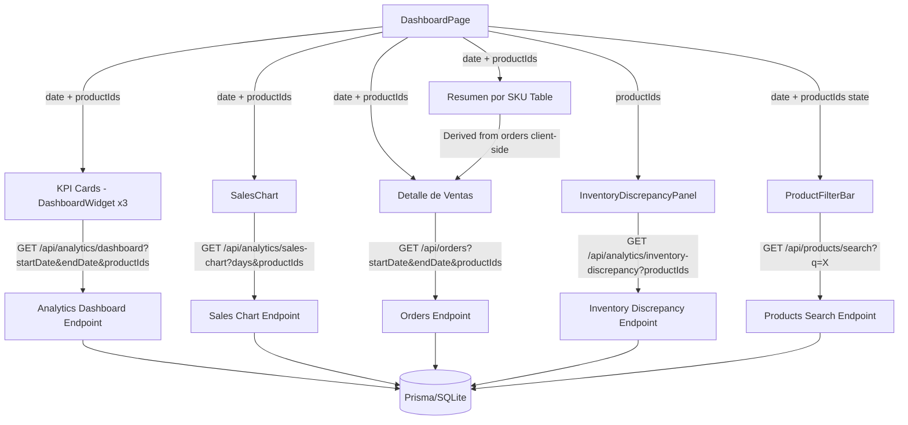
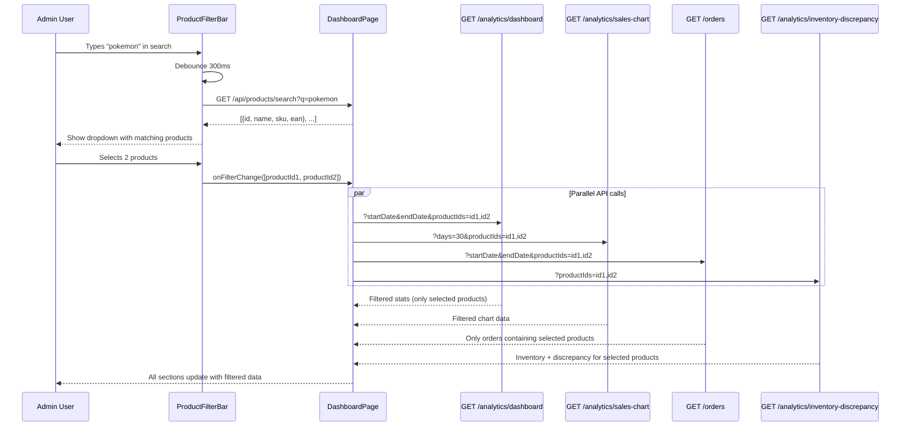
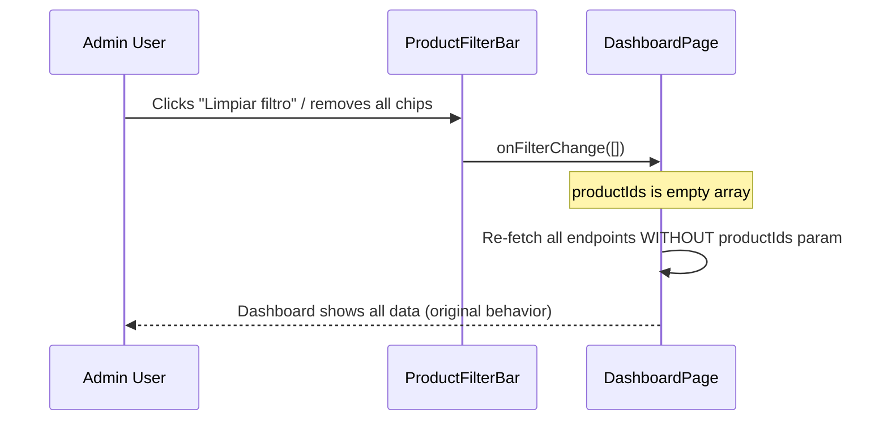
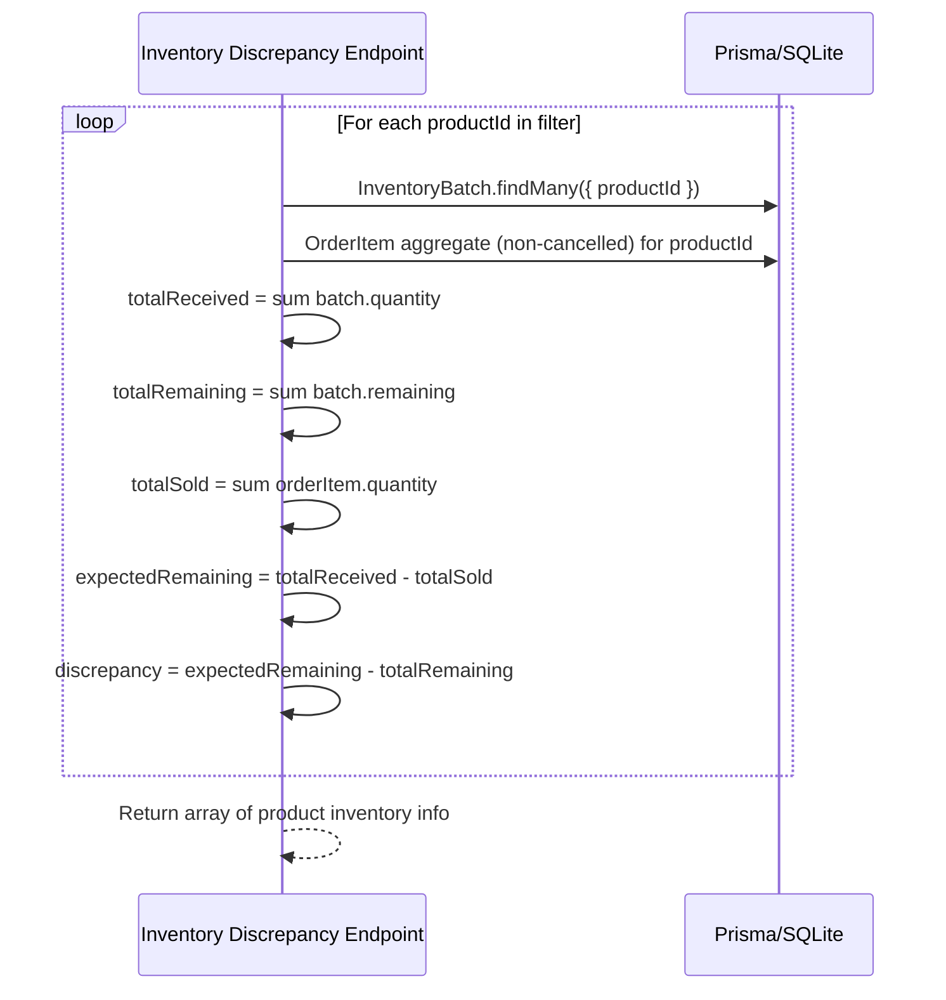

# Design Document: Sales EAN Lookup (Dashboard Product Filter)

## Overview

El feature "Sales EAN Lookup" transforma el Dashboard de ventas existente (`/admin`) para que toda la página sea filtrable por selección de EAN/SKU. En lugar de un panel separado, se agrega una barra de filtro multi-select (combobox buscable) junto al filtro de fechas existente. Cuando el admin selecciona uno o más productos por EAN o SKU, **todas** las secciones del dashboard se recalculan mostrando solo datos de esos productos: KPI cards (Ventas, Costos, Margen), gráfico de ventas, tabla "Resumen por SKU", y "Detalle de Ventas". Adicionalmente, al tener productos seleccionados aparece una sección de inventario/discrepancia con info de stock.

Cuando no hay productos seleccionados, el dashboard funciona exactamente como hoy — sin filtro = mostrar todo. Esto garantiza retrocompatibilidad total.

La implementación requiere: (1) un nuevo componente `ProductFilterBar` en el frontend, (2) agregar parámetros opcionales `productIds` a los endpoints existentes del backend (`/api/analytics/dashboard`, `/api/analytics/sales-chart`, `/api/orders`), (3) un nuevo endpoint para búsqueda de productos por EAN/SKU para el combobox, y (4) un nuevo endpoint o extensión para obtener datos de inventario/discrepancia de los productos seleccionados.

## Architecture



## Sequence Diagrams

### Main Flow: User Selects Products to Filter Dashboard



### Flow: Clear Filter (Return to Default)



### Discrepancy Calculation Flow



## Components and Interfaces

### Component 1: ProductFilterBar

**Purpose**: Multi-select searchable combobox that lets the admin filter the entire dashboard by one or more products (searchable by EAN, SKU, or name). Placed in the header area alongside the existing date filter.

```typescript
interface ProductFilterBarProps {
  selectedProductIds: string[];
  onFilterChange: (productIds: string[]) => void;
}

interface ProductOption {
  id: string;
  name: string;
  sku: string;
  ean: number | null;
}
```

**Responsibilities**:
- Render a searchable multi-select combobox with barcode/search icon
- Fetch matching products via `GET /api/products/search?q=<term>` as user types (debounced 300ms)
- Display selected products as removable chips/tags
- Provide "Limpiar filtro" button to clear all selections
- Emit `onFilterChange` with array of selected product IDs whenever selection changes
- Support searching by product name, SKU, or EAN number

### Component 2: InventoryDiscrepancyPanel

**Purpose**: Shows inventory and stock discrepancy information for the selected products. Only visible when one or more products are selected in the filter.

```typescript
interface InventoryDiscrepancyPanelProps {
  data: ProductInventoryInfo[];
}

interface ProductInventoryInfo {
  productId: string;
  productName: string;
  sku: string;
  ean: number | null;
  currentStock: number;
  totalReceived: number;
  totalSold: number;
  totalRemaining: number;
  expectedRemaining: number;
  discrepancy: number;
}
```

**Responsibilities**:
- Render a table/card showing inventory info per selected product
- Highlight discrepancies visually (red for missing stock, amber for extra stock, green for consistent)
- Show summary row with totals across all selected products
- Only render when `data.length > 0`

### Existing Components Modified (No New Components)

| Component | Change |
|-----------|--------|
| `DashboardPage` | Add `selectedProductIds` state, pass to all data hooks, render `ProductFilterBar` and `InventoryDiscrepancyPanel` |
| `useDashboardStats` hook | Accept optional `productIds` param, pass to API |
| `useSalesChart` hook | Accept optional `productIds` param, pass to API |
| `useOrders` hook | Accept optional `productIds` param, pass to API |
| `analyticsAPI.getDashboard` | Add `productIds` query param |
| `analyticsAPI.getSalesChart` | Add `productIds` query param |
| `ordersAPI.getAll` | Add `productIds` query param |
| SKU summary `useMemo` | Filter by `selectedProductIds` when set (client-side, already derived from orders) |

## Data Models

### API Changes: Existing Endpoints with New Optional Params

**GET /api/analytics/dashboard**
```
?startDate=2025-01-01&endDate=2025-01-31&productIds=uuid1,uuid2
```
- `productIds` (optional): Comma-separated product UUIDs
- When present: stats are calculated only from OrderItems matching those productIds
- When absent: behavior unchanged (all products)

**GET /api/analytics/sales-chart**
```
?days=30&productIds=uuid1,uuid2
```
- `productIds` (optional): Comma-separated product UUIDs
- When present: daily revenue/sales aggregated only from orders containing those products
- When absent: behavior unchanged

**GET /api/orders**
```
?startDate=X&endDate=Y&productIds=uuid1,uuid2
```
- `productIds` (optional): Comma-separated product UUIDs
- When present: returns only orders that contain at least one OrderItem with a matching productId
- When absent: behavior unchanged

### New Endpoint: Product Search for Combobox

**GET /api/products/search?q=pokemon&limit=20**

```typescript
// Response
Array<{
  id: string;
  name: string;
  sku: string;
  ean: number | null;
}>
```

- Searches `Product.name`, `Product.sku`, and `Product.ean` (cast to string)
- Returns max 20 results, ordered by relevance
- Only returns ACTIVE products
- Used by `ProductFilterBar` combobox

### New Endpoint: Inventory Discrepancy

**GET /api/analytics/inventory-discrepancy?productIds=uuid1,uuid2**

```typescript
// Response
interface InventoryDiscrepancyResponse {
  products: Array<{
    productId: string;
    productName: string;
    sku: string;
    ean: number | null;
    currentStock: number;
    totalReceived: number;
    totalSold: number;
    totalRemaining: number;
    expectedRemaining: number;
    discrepancy: number;
  }>;
}
```

- `productIds` (required): At least one product ID
- Calculates per-product: `expectedRemaining = totalReceived - totalSold`, `discrepancy = expectedRemaining - totalRemaining`
- `totalSold` excludes CANCELLED and REFUNDED orders

### Existing Models Used (No Schema Changes)

| Model | Fields Used |
|-------|-------------|
| `Product` | `id`, `sku`, `name`, `ean` (barcode), `price`, `cost`, `stock`, `images`, `status` |
| `OrderItem` | `productId`, `quantity`, `price`, `cost`, `orderId` |
| `Order` | `id`, `orderNumber`, `customerName`, `customerEmail`, `status`, `source`, `createdAt`, `total` |
| `InventoryBatch` | `productId`, `quantity`, `remaining` |

## Key Functions with Formal Specifications

### Function 1: Dashboard Stats with Product Filter (Backend)

```typescript
// Modified: GET /api/analytics/dashboard
async function getDashboardStats(
  startDate: string, endDate: string, productIds?: string[]
): Promise<DashboardStats>
```

**Preconditions:**
- `startDate` and `endDate` are valid YYYY-MM-DD strings, startDate <= endDate
- `productIds`, if provided, is a non-empty array of valid UUIDs
- Caller is authenticated with role ADMIN or STAFF

**Postconditions:**
- When `productIds` is empty/absent: returns stats for ALL products (existing behavior, unchanged)
- When `productIds` is provided: `totalSales`, `totalCost`, `totalMargin`, `orderCount` are calculated only from OrderItems where `productId IN productIds` within orders that are not CANCELLED/REFUNDED
- `marginPercent = totalSales > 0 ? (totalMargin / totalSales) * 100 : 0`
- No mutations to any database records

### Function 2: Sales Chart with Product Filter (Backend)

```typescript
// Modified: GET /api/analytics/sales-chart
async function getSalesChart(
  days: number, productIds?: string[]
): Promise<Array<{ date: string; sales: number; revenue: number }>>
```

**Preconditions:**
- `days` is a positive integer
- `productIds`, if provided, is a non-empty array of valid UUIDs

**Postconditions:**
- Returns one entry per day for the last `days` days
- When `productIds` is absent: revenue = sum of order totals (existing behavior)
- When `productIds` is provided: revenue = sum of (OrderItem.price * OrderItem.quantity) for matching productIds within non-cancelled orders for each day
- Each day entry has `date`, `sales` (subtotal), `revenue` (total)

### Function 3: Orders with Product Filter (Backend)

```typescript
// Modified: GET /api/orders
async function getOrders(
  params: OrderQueryParams & { productIds?: string[] }
): Promise<{ orders: Order[]; pagination: Pagination }>
```

**Preconditions:**
- `productIds`, if provided, is a non-empty array of valid UUIDs
- Other params (status, source, dates, search, page, limit) follow existing validation

**Postconditions:**
- When `productIds` is absent: returns all orders matching other filters (existing behavior)
- When `productIds` is provided: returns only orders that have at least one OrderItem with `productId IN productIds`
- Pagination counts reflect the filtered set
- Order items are NOT filtered - the full order is returned (all items), only the order-level filter applies

### Function 4: calculateDiscrepancy (Backend Helper)

```typescript
function calculateDiscrepancy(
  totalReceived: number,
  totalSold: number,
  actualRemaining: number
): { expectedRemaining: number; discrepancy: number }
```

**Preconditions:**
- `totalReceived` >= 0
- `totalSold` >= 0
- `actualRemaining` >= 0

**Postconditions:**
- `expectedRemaining` = `totalReceived` - `totalSold`
- `discrepancy` = `expectedRemaining` - `actualRemaining`
- `discrepancy` > 0 means stock is missing
- `discrepancy` < 0 means extra stock
- `discrepancy` === 0 means inventory is consistent

### Function 5: useProductSearch (Frontend Hook)

```typescript
function useProductSearch(query: string): {
  options: ProductOption[];
  isLoading: boolean;
}
```

**Preconditions:**
- `query` is a string (may be empty)

**Postconditions:**
- When `query.length < 2`: `options` is empty, no API call
- When `query.length >= 2`: fetches matching products after 300ms debounce
- `options` contains `{ id, name, sku, ean }` for each match
- Results are capped at 20 items

## Example Usage

```typescript
// === Backend: Modified analytics dashboard route ===
// server/src/routes/analytics.ts - GET /dashboard
const { startDate, endDate, productIds: rawProductIds } = req.query;
const productIds = rawProductIds
  ? (rawProductIds as string).split(',').filter(Boolean)
  : [];

// When productIds present, filter OrderItems by productId
const orderItemWhere = productIds.length > 0
  ? { productId: { in: productIds }, order: rangeWhere }
  : { order: rangeWhere };

const rangeOrderItems = await prisma.orderItem.findMany({
  where: orderItemWhere,
  select: { cost: true, quantity: true, price: true },
});

// === Backend: Modified orders route ===
// server/src/routes/orders.ts - GET /
const { productIds: rawPids } = req.query;
const productIds = rawPids ? (rawPids as string).split(',').filter(Boolean) : [];
if (productIds.length > 0) {
  where.items = { some: { productId: { in: productIds } } };
}

// === Frontend: DashboardPage state ===
const [selectedProductIds, setSelectedProductIds] = useState<string[]>([]);
const productIdsParam = selectedProductIds.length > 0 ? selectedProductIds : undefined;

// Pass to hooks
const { data: stats } = useDashboardStats(range.start, range.end, productIdsParam, { enabled: isAuthenticated });
const { data: chartData } = useSalesChart(days, productIdsParam, { enabled: isAuthenticated });
const { data: orders } = useOrders({ startDate: range.start, endDate: range.end, productIds: productIdsParam }, { enabled: isAuthenticated });

// === Frontend: API client additions ===
// analyticsAPI.getDashboard
getDashboard: (startDate?: string, endDate?: string, productIds?: string[]) => {
  const params = new URLSearchParams();
  if (startDate) params.set('startDate', startDate);
  if (endDate) params.set('endDate', endDate);
  if (productIds?.length) params.set('productIds', productIds.join(','));
  return fetchAPI<DashboardStats>(`/analytics/dashboard?${params}`);
},

// analyticsAPI.getInventoryDiscrepancy (new)
getInventoryDiscrepancy: (productIds: string[]) => {
  const params = new URLSearchParams({ productIds: productIds.join(',') });
  return fetchAPI<InventoryDiscrepancyResponse>(`/analytics/inventory-discrepancy?${params}`);
},

// === Frontend: ProductFilterBar in DashboardPage JSX ===
<ProductFilterBar
  selectedProductIds={selectedProductIds}
  onFilterChange={setSelectedProductIds}
/>

// === Frontend: Conditional InventoryDiscrepancyPanel ===
{selectedProductIds.length > 0 && inventoryData && (
  <InventoryDiscrepancyPanel data={inventoryData.products} />
)}
```

## Correctness Properties

*A property is a characteristic or behavior that should hold true across all valid executions of a system — essentially, a formal statement about what the system should do. Properties serve as the bridge between human-readable specifications and machine-verifiable correctness guarantees.*

### Property 1: Retrocompatibility (empty filter = no change)

*For any* database state and date range, calling the Dashboard_Stats_Endpoint, Sales_Chart_Endpoint, or Orders_Endpoint without the productIds parameter SHALL produce identical results to calling them with an empty productIds parameter.

**Validates: Requirements 2.2, 3.2, 4.3, 5.1**

### Property 2: KPI filtered calculation correctness

*For any* set of productIds and date range, the totalSales returned by the Dashboard_Stats_Endpoint SHALL equal the sum of (OrderItem.price × OrderItem.quantity) for all OrderItems where productId is in the provided set, within orders that are not CANCELLED or REFUNDED and fall within the date range. Likewise, totalCost SHALL equal the sum of (OrderItem.cost × OrderItem.quantity) for the same set, and totalMargin SHALL equal totalSales minus totalCost.

**Validates: Requirements 2.1, 8.1**

### Property 3: Margin percent formula

*For any* totalSales and totalMargin values, marginPercent SHALL equal (totalMargin / totalSales) × 100 when totalSales is greater than zero, and zero otherwise.

**Validates: Requirement 2.3**

### Property 4: Chart filtered aggregation correctness

*For any* set of productIds and number of days, each daily entry in the Sales_Chart_Endpoint response SHALL have revenue equal to the sum of (OrderItem.price × OrderItem.quantity) for matching productIds within non-cancelled, non-refunded orders on that day.

**Validates: Requirements 3.1, 8.2**

### Property 5: Chart completeness invariant

*For any* requested number of days and any productIds filter (including empty), the Sales_Chart_Endpoint SHALL return exactly that number of entries, one per day.

**Validates: Requirement 3.3**

### Property 6: Order inclusion rule

*For any* set of productIds, every order returned by the Orders_Endpoint SHALL contain at least one OrderItem with a productId present in the provided set.

**Validates: Requirement 4.1**

### Property 7: Order item completeness

*For any* order returned by the filtered Orders_Endpoint, the order's items array SHALL contain all OrderItems belonging to that order, not just those matching the productIds filter.

**Validates: Requirement 4.2**

### Property 8: Discrepancy formula correctness

*For any* product, the Inventory_Discrepancy_Endpoint SHALL compute expectedRemaining as totalReceived minus totalSold, and discrepancy as expectedRemaining minus totalRemaining, where totalSold excludes items from CANCELLED and REFUNDED orders.

**Validates: Requirements 6.3, 6.4, 6.5**

### Property 9: Search result invariants

*For any* search query, every product returned by the Product_Search_Endpoint SHALL have status ACTIVE, SHALL include the fields id, name, sku, and ean, and the total number of results SHALL not exceed 20.

**Validates: Requirements 7.2, 7.3, 7.4**

### Property 10: Search endpoint purity

*For any* search query, calling the Product_Search_Endpoint SHALL not modify any database records — the database state before and after the call SHALL be identical.

**Validates: Requirement 7.5**

### Property 11: Product selection round-trip

*For any* sequence of product selections and removals in the ProductFilterBar, the emitted productIds list SHALL contain exactly the set of currently selected product IDs — adding a product includes its ID, removing a product excludes its ID.

**Validates: Requirements 1.4, 1.5**

## Error Handling

### Error Scenario 1: Invalid productIds Format

**Condition**: `productIds` query param contains non-UUID values
**Response**: Backend ignores invalid IDs (filters them out). If all IDs are invalid, behaves as if no filter was applied.
**Recovery**: No user-facing error; dashboard shows unfiltered data.

### Error Scenario 2: Product Search Returns No Results

**Condition**: User types a search term that matches no products
**Response**: Combobox dropdown shows "No se encontraron productos" message
**Recovery**: User can modify search term or clear input.

### Error Scenario 3: Filtered Dashboard Has No Data

**Condition**: Selected products have no orders in the date range
**Response**: KPI cards show $0 / 0 orders. Chart shows flat zero line. SKU summary and order detail show empty states.
**Recovery**: User can change date range or clear product filter.

### Error Scenario 4: Network Error During Filter Change

**Condition**: API calls fail when product filter changes
**Response**: Each hook independently shows error state. Previously loaded data remains visible until new data arrives.
**Recovery**: User can retry by toggling the filter or refreshing the page.

### Error Scenario 5: Inventory Discrepancy Endpoint Fails

**Condition**: The inventory-discrepancy endpoint returns an error
**Response**: `InventoryDiscrepancyPanel` shows an error message but does NOT affect the rest of the dashboard (KPIs, chart, orders still work).
**Recovery**: Panel shows retry button. Other dashboard sections remain functional.

## Testing Strategy

### Unit Testing Approach

- Test `calculateDiscrepancy` helper with various inputs (zero stock, negative expected, matching values)
- Test productIds parsing logic (empty string, single ID, multiple IDs, invalid values)
- Test that dashboard stats endpoint returns correct filtered totals given known seed data
- Test that orders endpoint correctly filters orders containing specific productIds
- Test `ProductFilterBar` component renders chips, handles selection/deselection

### Property-Based Testing Approach

**Property Test Library**: fast-check

- **Property 1**: For any set of productIds and date range, `totalSales` from the dashboard endpoint equals the sum of `OrderItem.price * OrderItem.quantity` for matching items in non-cancelled orders
- **Property 2**: For any set of inventory batches and order items, `discrepancy = (sum(batch.quantity) - sum(orderItem.quantity)) - sum(batch.remaining)`
- **Property 3**: When productIds is empty, the dashboard endpoint returns the same result as when productIds param is omitted entirely
- **Property 4**: Every order returned by the filtered orders endpoint contains at least one OrderItem with productId in the filter set

### Integration Testing Approach

- Seed database with known products (with EAN/SKU), orders, and inventory batches
- Test full flow: search product -> select -> verify KPIs recalculate -> verify chart filters -> verify orders filter -> verify inventory panel appears
- Test clearing filter returns dashboard to original state
- Test with multiple products selected simultaneously
- Test date range + product filter combination

## Performance Considerations

- Adding `productIds` filter to existing queries uses Prisma's `in` operator which maps to SQL `IN (...)`. For small filter sets (typical: 1-10 products), this is negligible overhead.
- The product search endpoint should use indexed columns (`sku` is unique, `ean` is indexed via `barcode` column). `name` search uses `contains` which is a LIKE query - acceptable for the current product catalog size.
- All filtered API calls happen in parallel (React hooks fire simultaneously), so the dashboard update latency is bounded by the slowest endpoint, not the sum.
- The `InventoryDiscrepancyPanel` data is fetched only when products are selected, avoiding unnecessary queries when the filter is empty.

## Security Considerations

- All modified endpoints retain their existing `authenticate` + `requireRole('ADMIN', 'STAFF')` middleware. No new auth requirements.
- `productIds` are UUIDs validated/filtered on the backend. No SQL injection risk (Prisma parameterizes all queries).
- The product search endpoint also requires admin auth - it is not publicly accessible.
- No sensitive data is exposed beyond what the admin already has access to via existing endpoints.

## Dependencies

- **Existing**: Prisma ORM, Express router, `authenticate`/`requireRole` middleware, `useFetch` hook, design system components (Card, Badge, DashboardWidget, SalesChart)
- **No new npm dependencies required** - the multi-select combobox will be built using existing UI primitives (Input, Popover/Dropdown from the design system) or a lightweight approach with native elements
- The feature extends existing endpoints rather than creating entirely new data flows, minimizing integration risk
