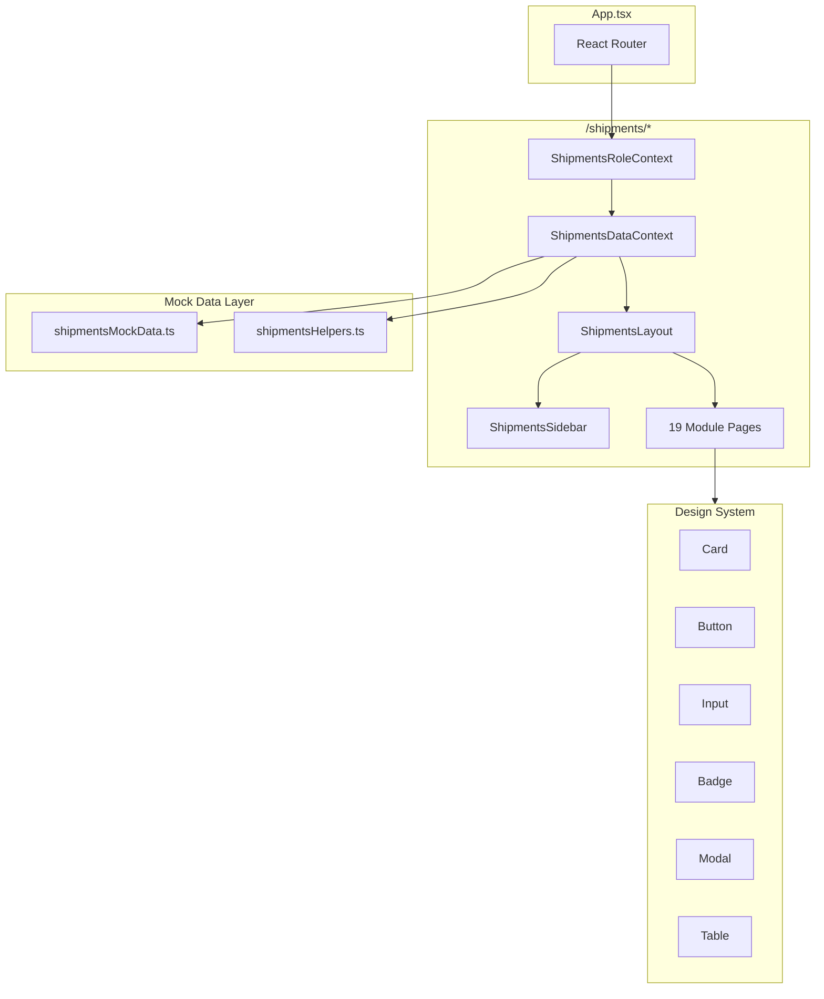

# Design Document — Shipments ERP

## Overview

El módulo Shipments ERP es una sección frontend independiente dentro de HobbyZamora que gestiona el ciclo completo de importación: compra en Japón → envío → internación aduanera → costeo → bodega Chile → venta. Se accede en `/shipments` y funciona con datos mock (sin backend), usando el design system existente sin efectos glow ni pixel-font.

La arquitectura sigue el patrón establecido por AdminLayout/AdminSidebar: un layout con sidebar colapsable a la izquierda y área de contenido a la derecha. Un contexto de rol propio (ShipmentsRoleContext) controla qué módulos ve cada usuario. Los 19 módulos se organizan en 5 secciones de navegación: Japón, Envíos, Chile, Finanzas y Principal.

Toda la lógica de negocio (cálculos de costeo, disponibilidad por SKU, estados financieros) opera sobre un estado React centralizado alimentado por datos mock tipados, preparado para migración futura a API REST.

## Architecture

### Diagrama de alto nivel



### Decisiones de diseño

1. **Contexto de rol propio** — ShipmentsRoleContext es independiente de AdminAuthContext. El ERP de envíos no requiere autenticación real; usa un selector de rol en el sidebar que persiste en `localStorage`. Esto permite desarrollo y testing sin backend.

2. **Contexto de datos centralizado** — ShipmentsDataContext envuelve todo el estado mutable del ERP (compras, boletas, cajas, stock, ventas, etc.) en un solo provider con funciones de mutación. Esto simula lo que sería un backend y permite que cualquier módulo lea/escriba estado compartido.

3. **Sin glow ni pixel-font** — Igual que el admin dashboard, el ERP usa los design tokens pero sin `shadow-[0_0_*]` glow effects ni `font-[family-name:var(--font-display)]` en texto general. Solo `font-body` (Outfit) y `font-mono` para precios.

4. **Formateo de moneda centralizado** — Una función `formatJPY(n)` y `formatCLP(n)` usando `Intl.NumberFormat('es-CL')` con prefijos `¥` y `$` respectivamente, aplicada consistentemente con clases `font-[family-name:var(--font-mono)] text-primary`.


## Components and Interfaces

### Estructura de archivos

```
src/app/
├── contexts/
│   ├── ShipmentsRoleContext.tsx      # Rol activo + Role_Guard logic
│   └── ShipmentsDataContext.tsx      # Estado centralizado del ERP
├── components/
│   ├── layout/
│   │   ├── ShipmentsLayout.tsx       # Layout principal (sidebar + content)
│   │   └── ShipmentsSidebar.tsx      # Sidebar con secciones colapsables
│   └── shipments/
│       ├── KPICard.tsx               # Card de KPI reutilizable
│       ├── PriceDisplay.tsx          # Componente de precio formateado
│       ├── StatusBadge.tsx           # Badge de estado con mapeo de colores
│       └── CurrencyFormatter.ts     # Funciones formatJPY / formatCLP
├── pages/shipments/
│   ├── DashboardPage.tsx             # Dashboard principal
│   ├── ComprasPage.tsx               # Registro de Compras
│   ├── BodegaJaponPage.tsx           # Bodega Japón
│   ├── BoletasPage.tsx               # Boletas
│   ├── PagosPage.tsx                 # Confirmar Pagos
│   ├── GAVJaponPage.tsx              # Gastos Fijos Japón
│   ├── CajasPage.tsx                 # Cajas / Envíos
│   ├── BodegaTransitoPage.tsx        # Bodega Tránsito
│   ├── ComprasWebPage.tsx            # Compras Web
│   ├── InternacionPage.tsx           # Internación
│   ├── CosteoPage.tsx               # Costeo de Cajas
│   ├── BodegaChilePage.tsx           # Bodega Chile
│   ├── ComprasLocalesPage.tsx        # Compras Locales
│   ├── VentasPage.tsx                # Ventas
│   ├── GAVChilePage.tsx              # Gastos Fijos Chile
│   ├── EstadoResultadosPage.tsx      # Estado de Resultados
│   ├── BalancePage.tsx               # Balance General
│   ├── FlujoCajaPage.tsx             # Flujo de Caja
│   └── ConfiguracionPage.tsx         # Configuración
└── data/
    └── shipmentsMockData.ts          # Datos mock + tipos + helpers
```

### Componentes clave

#### ShipmentsRoleContext

```typescript
interface ShipmentsRoleContextType {
  role: ShipmentsRole;
  setRole: (role: ShipmentsRole) => void;
  hasAccess: (moduleId: string) => boolean;
  accessibleModules: NavItem[];
}

type ShipmentsRole = 'admin' | 'japon' | 'chile' | 'contador';
```

- Persiste el rol en `localStorage` key `shipments_role`
- Expone `hasAccess(moduleId)` que consulta la matriz ROLE_PAGES
- Provee `accessibleModules` filtrado para el sidebar

#### ShipmentsDataContext

```typescript
interface ShipmentsDataContextType {
  // State
  compras: PurchaseRecord[];
  boletas: Invoice[];
  boletaItems: Record<string, InvoiceItem[]>;
  cajas: Box[];
  stockChile: ChileStockEntry[];
  pedidosWeb: WebOrder[];
  comprasChile: LocalPurchase[];
  ventas: SaleRecord[];
  gavChile: GAVEntry[];
  config: ERPConfig;

  // Computed
  calcDisponibleBySku: (sku: string) => number;

  // Mutations
  addCompra: (data: Omit<PurchaseRecord, 'id' | 'sku'>) => PurchaseRecord;
  updateCompra: (id: number, data: Partial<PurchaseRecord>) => void;
  addBoleta: (data: NewBoletaInput) => Invoice;
  confirmPayment: (boletaId: string, paymentData: PaymentConfirmation) => void;
  addCaja: (data: NewCajaInput) => Box;
  updateCaja: (id: string, data: Partial<Box>) => void;
  deleteCaja: (id: string) => void;
  saveInternacion: (cajaId: string, data: InternacionData) => void;
  confirmCosteo: (cajaId: string, costeoData: CosteoEntry[]) => void;
  updatePrecioVenta: (stockId: string, precio: number) => void;
  addVenta: (data: NewVentaInput) => SaleRecord;
  confirmGAV: (id: number) => void;
  updateConfig: (data: Partial<ERPConfig>) => void;
  addPedidoWeb: (data: NewWebOrderInput) => WebOrder;
  addCompraChile: (data: NewLocalPurchaseInput) => LocalPurchase;
  generateGAVBoleta: () => Invoice;
}
```

- Inicializa estado desde `shipmentsMockData.ts`
- Todas las mutaciones actualizan estado React inmediatamente
- `calcDisponibleBySku` implementa: `compra.cant - unitsInActiveBoxes - unitsInChileStock`

#### ShipmentsLayout

Sigue el patrón exacto de AdminLayout:

```tsx
<div className="flex h-screen bg-background overflow-hidden">
  <ShipmentsSidebar />
  <main className="flex-1 overflow-y-auto">
    <div className="max-w-7xl mx-auto p-6">
      <Outlet />
    </div>
  </main>
</div>
```

No requiere autenticación — el acceso es directo.

#### ShipmentsSidebar

Sigue el patrón de AdminSidebar con estas diferencias:
- Incluye un dropdown de selección de rol en el header
- Los items de navegación se agrupan en 5 secciones colapsables (Japón, Envíos, Chile, Finanzas, Principal)
- Filtra items visibles según `ShipmentsRoleContext.hasAccess()`
- Usa iconos de Lucide React para cada módulo

```typescript
interface SidebarSection {
  label: string;
  items: NavItem[];
  defaultOpen: boolean;
}

interface NavItem {
  id: string;
  label: string;
  icon: LucideIcon;
  path: string;
}
```

#### KPICard

Componente reutilizable para las tarjetas de métricas que aparecen en Dashboard, Bodega Japón, Bodega Chile, etc.

```typescript
interface KPICardProps {
  title: string;
  value: string | number;
  icon: LucideIcon;
  trend?: { value: number; label: string };
  variant?: 'default' | 'warning' | 'success' | 'danger';
}
```

Usa `Card` del design system sin glow, con icono y valor destacado.

#### PriceDisplay

Componente inline para mostrar precios formateados:

```typescript
interface PriceDisplayProps {
  amount: number;
  currency: 'JPY' | 'CLP';
  className?: string;
}
```

Aplica automáticamente `font-[family-name:var(--font-mono)] text-primary` y el formato correcto.

#### StatusBadge

Mapea estados del ERP a variantes del Badge del design system:

```typescript
const statusMap = {
  por_pagar: { label: 'Por Pagar', variant: 'warning' },
  esp_pago: { label: 'Esp. Pago', variant: 'info' },
  pagado: { label: 'Pagado', variant: 'success' },
  sin_pagar: { label: 'Sin Pagar', variant: 'danger' },
  transito: { label: '✈️ En Tránsito', variant: 'info' },
  llegada: { label: '📦 Llegada', variant: 'warning' },
  costeada: { label: '✅ Costeada', variant: 'success' },
  pendiente: { label: 'Pendiente', variant: 'warning' },
};
```

### Routing

Las rutas se integran en `src/app/routes.tsx` bajo `/shipments`:

```typescript
// Shipments ERP Routes
{
  path: '/shipments',
  Component: ShipmentsApp,  // Wraps RoleContext + DataContext + Layout
  children: [
    { index: true, Component: DashboardPage },
    { path: 'compras', Component: ComprasPage },
    { path: 'bodega-japon', Component: BodegaJaponPage },
    { path: 'boletas', Component: BoletasPage },
    { path: 'pagos', Component: PagosPage },
    { path: 'gav-japon', Component: GAVJaponPage },
    { path: 'cajas', Component: CajasPage },
    { path: 'bodega-transito', Component: BodegaTransitoPage },
    { path: 'compras-web', Component: ComprasWebPage },
    { path: 'internacion', Component: InternacionPage },
    { path: 'costeo', Component: CosteoPage },
    { path: 'bodega-chile', Component: BodegaChilePage },
    { path: 'compras-chile', Component: ComprasLocalesPage },
    { path: 'ventas', Component: VentasPage },
    { path: 'gav-chile', Component: GAVChilePage },
    { path: 'eerr', Component: EstadoResultadosPage },
    { path: 'balance', Component: BalancePage },
    { path: 'flujo', Component: FlujoCajaPage },
    { path: 'config', Component: ConfiguracionPage },
  ],
}
```

`ShipmentsApp` es un wrapper que provee los contextos y el layout:

```tsx
function ShipmentsApp() {
  return (
    <ShipmentsRoleProvider>
      <ShipmentsDataProvider>
        <ShipmentsLayout>
          <Outlet />
        </ShipmentsLayout>
      </ShipmentsDataProvider>
    </ShipmentsRoleProvider>
  );
}
```

## Data Models

### Tipos TypeScript

Todos los tipos se definen y exportan desde `src/app/data/shipmentsMockData.ts`.

```typescript
// === Roles ===
export type ShipmentsRole = 'admin' | 'japon' | 'chile' | 'contador';

// === Compras (Purchases) ===
export type PaymentState = 'por_pagar' | 'esp_pago' | 'pagado';
export type LocationState = 'japon' | 'transito' | 'chile';

export interface PurchaseRecord {
  id: number;
  sku: string;                    // JP-XXXX
  fecha: string;                  // YYYY-MM-DD
  tipo: string;                   // 'Producto' | 'Arriendo/App' | etc.
  nombre: string;
  ean: string;                    // opcional, puede ser ''
  tarjeta: string;                // método de pago
  precioU: number;                // precio unitario ¥
  cant: number;                   // cantidad total (inmutable)
  total: number;                  // precioU * cant
  estado: PaymentState;
  bodega: LocationState;
  tc: number | null;              // tipo de cambio ¥→CLP
}

// === Boletas (Invoices) ===
export type InvoiceState = 'sin_pagar' | 'pagado';

export interface Invoice {
  id: string;                     // BOL-YYYY-NNN | BOL-YYYY-GAV-NNN
  fecha: string;
  productos: number | string;     // cantidad de items o descripción
  subtotalJPY: number;
  comision: number;               // % comisión
  totalJPY: number;
  tc: number;
  totalCLP: number;
  estado: InvoiceState;
}

export interface InvoiceItem {
  fecha: string;
  tipo: string;
  nombre: string;
  ean: string;
  precioU: number;                // ¥
  cant: number;
  comPct: number;
  tc: number;
}

// === Cajas (Boxes) ===
export type BoxState = 'transito' | 'llegada' | 'costeada';

export interface BoxProduct {
  _compraId: number;
  _sku: string;
  nombre: string;
  ean: string;
  cant: number;                   // cantidad en esta caja
  precioU: number;                // ¥
  tc: number;
}

export interface InternacionData {
  arancel: number;                // CLP
  iva: number;                    // CLP — IVA Crédito Fiscal
  total: number;
}

export interface Box {
  id: string;                     // nombre único
  fecha: string;
  estado: BoxState;
  flete_jpy: number;
  mo_horas: number;
  mo_tarifa: number;              // CLP/hora
  mat_jpy: number;
  tc_envio: number;
  internacion: InternacionData | null;
  productos: BoxProduct[];
}

// === Stock Chile ===
export interface ChileStockEntry {
  id: string;
  _sku: string;
  nombre: string;
  ean: string;
  caja: string;                   // id de la caja origen
  cant: number;
  costoUnit: number;              // CLP
  precioVenta: number | null;
}

// === Pedidos Web ===
export interface WebOrderProduct {
  nombre: string;
  ean: string;
  cant: number;
  precioUSD: number;
  precioCLP: number;
  pctCosteo: number;
  costoUnit: number;
}

export interface WebOrder {
  id: string;                     // WEB-NNN
  fecha: string;
  portal: string;
  orden: string;
  estado: 'pendiente' | 'costeado';
  costoEnvioIntern: number;       // CLP
  tc: number;
  productos: WebOrderProduct[];
}

// === Compras Chile (Local Purchases) ===
export interface LocalPurchase {
  id: string;                     // CC-NNN
  fecha: string;
  tipo: 'producto' | 'gasto';
  docTipo: 'factura' | 'boleta';
  proveedor: string;
  descripcion: string;
  monto: number;                  // CLP
  iva: number;                    // CLP (solo facturas)
  ivaCredito: boolean;
  estado: 'pagado' | 'pendiente';
}

// === Ventas (Sales) ===
export type SalesChannel = 'Instagram' | 'TikTok' | 'Mercado Libre' | 'Web' | 'Local';

export interface SaleRecord {
  id: string;
  fecha: string;
  producto: string;
  ean: string;
  cant: number;
  precioVenta: number;
  costo: number;                  // costoUnit del stock
  total: number;
  canal: SalesChannel;
}

// === GAV Chile ===
export interface GAVEntry {
  id: number;
  concepto: string;
  monto: number;                  // CLP
  adjunto: boolean;
  estado: 'pendiente' | 'pagado';
  docTipo: 'factura' | 'boleta';
  ivaCredito: boolean;
  fechaPago: string | null;
}

// === Configuración ===
export interface BankAccount {
  titular: string;
  rut: string;
  banco: string;
  tipo: string;
  numero: string;
}

export interface ERPConfig {
  cuentas: BankAccount[];
  metodosPago: string[];
  arrBodegaJP: number;            // ¥/mes
  appBeyblade: number;            // ¥/mes
  comisionPct: number;            // %
}
```

### Funciones helper exportadas

```typescript
// Calcula unidades disponibles en Japón para un SKU
export function calcDisponibleBySku(
  sku: string,
  compras: PurchaseRecord[],
  cajas: Box[],
  stockChile: ChileStockEntry[]
): number;

// Formatea montos en JPY: ¥25.000
export function formatJPY(amount: number): string;

// Formatea montos en CLP: $1.250.000
export function formatCLP(amount: number): string;

// Genera el siguiente SKU secuencial
export function nextSku(compras: PurchaseRecord[]): string;

// Genera el siguiente ID de boleta
export function nextBoletaId(boletas: Invoice[], isGAV?: boolean): string;

// Calcula el costeo unitario de un producto en una caja
export function calcCostoUnitario(
  box: Box,
  productPct: number,
  productCant: number
): number;
```

### Datos mock

El archivo `shipmentsMockData.ts` exporta datos iniciales realistas:

- **10+ PurchaseRecord** con estados variados (por_pagar, esp_pago, pagado) y ubicaciones (japon, transito, chile)
- **3+ Box** en estados transito, llegada, costeada, cada una con 2-4 productos
- **3+ Invoice** con estados sin_pagar y pagado
- **5+ ChileStockEntry** con costos unitarios calculados y precios de venta variados
- **5+ SaleRecord** en canales Instagram, TikTok, Mercado Libre, Web, Local
- **5+ GAVEntry** para Chile con estados pendiente y pagado
- **3 BankAccount** con datos de ejemplo
- **ERPConfig** con valores por defecto (arriendo ¥25.000, app ¥550, comisión 13%)

Todos los datos usan SKU formato `JP-XXXX` consistentemente y las relaciones entre entidades son coherentes (los productos en cajas referencian compras existentes, el stock Chile referencia cajas existentes, etc.).

### Matriz de acceso por rol

```typescript
export const ROLE_PAGES: Record<ShipmentsRole, string[]> = {
  admin: [
    'dashboard', 'compras', 'boletas', 'pagos', 'gav-japon', 'cajas',
    'compras-web', 'internacion', 'costeo', 'bodega-japon', 'bodega-transito',
    'bodega-chile', 'compras-chile', 'ventas', 'gav-chile',
    'eerr', 'balance', 'flujo', 'config',
  ],
  japon: ['compras', 'boletas', 'gav-japon', 'cajas'],
  chile: [
    'dashboard', 'bodega-japon', 'bodega-transito', 'bodega-chile', 'ventas',
    'cajas', 'compras-web', 'internacion', 'costeo', 'compras-chile',
  ],
  contador: ['dashboard', 'eerr', 'balance', 'flujo', 'gav-chile', 'gav-japon'],
};
```

## Correctness Properties

*A property is a characteristic or behavior that should hold true across all valid executions of a system — essentially, a formal statement about what the system should do. Properties serve as the bridge between human-readable specifications and machine-verifiable correctness guarantees.*

### Property 1: Currency formatting produces valid locale strings

*For any* non-negative number, `formatJPY(n)` SHALL return a string starting with `¥` followed by the number formatted with `es-CL` locale (dots as thousands separators), and `formatCLP(n)` SHALL return a string starting with `$` followed by the same locale formatting. Both functions SHALL be idempotent in the sense that parsing the numeric portion back yields the original integer value.

**Validates: Requirements 4.5, 15.4, 23.1, 23.2**

### Property 2: calcDisponibleBySku returns correct available units

*For any* valid ERP state (compras, cajas, stockChile) and *for any* SKU present in compras, `calcDisponibleBySku(sku)` SHALL return `compra.cant - unitsInActiveBoxes - unitsInChileStock`, where `unitsInActiveBoxes` is the sum of `cant` for that SKU across all boxes with estado `transito` or `llegada`, and `unitsInChileStock` is the sum of `cant` for that SKU across all Chile stock entries. The result SHALL never be negative.

**Validates: Requirements 3.7, 5.1**

### Property 3: SKU generation is sequential and well-formatted

*For any* list of existing purchases with valid SKUs, `nextSku()` SHALL return a string matching the pattern `JP-XXXX` (where X is a digit) whose numeric portion is exactly one greater than the maximum numeric portion among existing SKUs. For an empty list, it SHALL return `JP-0001`.

**Validates: Requirements 3.6, 4.3**

### Property 4: Invoice total calculation follows the commission formula

*For any* list of selected items (each with precioU and cant) and *for any* comisión percentage between 0 and 100, the invoice totals SHALL satisfy: `subtotalJPY = Σ(precioU × cant)`, `totalJPY = subtotalJPY × (1 + comision/100)`, and `totalCLP = totalJPY / tc` (where tc > 0).

**Validates: Requirements 6.3**

### Property 5: Payment confirmation transitions invoice and related purchases to pagado

*For any* invoice with estado `sin_pagar` and *for any* set of purchases linked to that invoice, confirming payment SHALL set `invoice.estado = 'pagado'` and set `compra.estado = 'pagado'` for every related purchase.

**Validates: Requirements 7.3**

### Property 6: Costo unitario calculation follows the distribution formula

*For any* box with defined costs (subtotalCLP, fleteCLP, moCLP, matCLP, internCLP) and *for any* product in that box with a cost percentage (pct) and quantity (cant > 0), the costo unitario SHALL equal `(subtotalCLP × pct/100 + fleteCLP × pct/100 + moCLP × pct/100 + matCLP × pct/100 + internCLP × pct/100) / cant`.

**Validates: Requirements 13.3**

### Property 7: Costeo percentages must sum to 100

*For any* array of product cost percentages submitted for costeo confirmation, the validation function SHALL accept if and only if the sum of all percentages equals exactly 100.

**Validates: Requirements 13.4**

### Property 8: Costeo confirmation creates Chile stock entries and updates box state

*For any* box in estado `llegada` with valid costeo data (percentages summing to 100), confirming costeo SHALL: (a) create one ChileStockEntry per product with the calculated costoUnit, (b) set `box.estado = 'costeada'`, and (c) update `compra.bodega` to `'chile'` for any purchase whose `calcDisponibleBySku` becomes 0.

**Validates: Requirements 13.5**

### Property 9: Margin calculation and color assignment

*For any* ChileStockEntry with `precioVenta > 0` and `costoUnit >= 0`, the margin SHALL equal `(precioVenta - costoUnit) / precioVenta × 100`, and the color SHALL be green if margin > 30, orange if margin > 15, and red if margin ≤ 15.

**Validates: Requirements 14.3**

### Property 10: Sale registration deducts from Chile stock

*For any* ChileStockEntry with `cant > 0` and *for any* sale quantity where `1 ≤ quantity ≤ cant`, registering the sale SHALL decrease `stockEntry.cant` by exactly the sold quantity.

**Validates: Requirements 15.3**

### Property 11: Income statement calculation with pagado filter

*For any* valid ERP state, the income statement SHALL satisfy: `Ingresos = Σ(venta.total)`, `CostoVenta = Σ(venta.costo × venta.cant)`, `MargenBruto = Ingresos - CostoVenta`, `GAVTotal = Σ(gavJapon where estado=pagado) + Σ(gavChile where estado=pagado)`, `EBIT = MargenBruto - GAVTotal`, `IVACredito = Σ(internacion.iva) + Σ(comprasChile where ivaCredito=true).iva`, and `ResultadoNeto = EBIT + IVACredito`. GAV entries with estado `pendiente` SHALL NOT be included.

**Validates: Requirements 18.1, 18.2**

### Property 12: Revenue grouping by channel preserves total

*For any* list of sales, grouping by `canal` and summing each group's totals SHALL produce subtotals whose sum equals the overall `Σ(venta.total)`.

**Validates: Requirements 18.4**

### Property 13: Balance sheet equation holds

*For any* valid ERP state, the balance sheet SHALL satisfy: `Patrimonio = Activos - Pasivos`, where `Activos = CajaEstimada + InvChile + InvJapon + IVACredito`, `InvChile = Σ(stockChile.cant × stockChile.costoUnit)`, `InvJapon = Σ(compra.precioU × compra.cant / compra.tc)` for purchases with bodega=japon, and `Pasivos = Σ(boleta.totalCLP)` for boletas with estado=sin_pagar.

**Validates: Requirements 19.1, 19.2, 19.3**

### Property 14: Cash flow equation holds

*For any* valid ERP state, the cash flow SHALL satisfy: `FlujoNeto = Ingresos - EgresosJP - EgresosCL`, where `Ingresos = Σ(venta.total)`, `EgresosJP = Σ(boleta.totalCLP where estado=pagado)`, and `EgresosCL = Σ(gavChile.monto where estado=pagado) + Σ(comprasChile.monto where estado=pagado)`.

**Validates: Requirements 20.1**

## Error Handling

### Validación de entrada

| Contexto | Validación | Comportamiento |
|----------|-----------|----------------|
| Nueva compra | Campos requeridos vacíos | Mostrar error en campo con `Input error` prop, no cerrar modal |
| Nueva compra | Precio ≤ 0 o cantidad ≤ 0 | Mostrar error "Valor debe ser mayor a 0" |
| Nueva caja | Nombre duplicado | Mostrar error "Ya existe una caja con ese nombre" |
| Nueva caja | Cantidad > disponible | Limitar input a `max={disponible}`, deshabilitar si 0 |
| Costeo | Porcentajes no suman 100% | Deshabilitar botón "Confirmar", mostrar suma actual en rojo |
| Costeo | Cantidad = 0 en producto | Mostrar error "Cantidad debe ser mayor a 0" |
| Venta | Cantidad > stock disponible | Mostrar error "Stock insuficiente", limitar a máximo disponible |
| GAV Chile | Confirmar sin comprobante | Mostrar toast error + borde rojo en zona de comprobante |
| Configuración | Campo numérico con texto | Usar `type="number"` en inputs, ignorar entrada no numérica |
| Boleta | Sin productos seleccionados | Deshabilitar botón "Generar", mostrar hint |
| Pago | Monto no coincide con total | Mostrar advertencia con diferencia |

### Estados vacíos

Cada módulo con tabla o grid debe manejar el caso de datos vacíos usando el componente `EmptyState` del design system con icono relevante, mensaje en español, y acción sugerida cuando aplique.

### Errores de navegación

- Si un usuario accede directamente a una ruta de módulo sin acceso para su rol actual, `ShipmentsLayout` redirige al primer módulo accesible
- Si la ruta no coincide con ningún módulo, se muestra la página 404 existente del router

### Formato de moneda

- `formatJPY` y `formatCLP` manejan `NaN`, `Infinity`, y valores negativos retornando `¥0` o `$0` respectivamente
- Valores `null` o `undefined` se tratan como 0

## Testing Strategy

### Enfoque dual

El testing combina dos estrategias complementarias:

1. **Unit tests (example-based)** — Para interacciones UI específicas, rendering de componentes, y edge cases
2. **Property-based tests** — Para validar las 14 propiedades de correctness definidas arriba sobre la lógica de negocio pura

### Property-Based Testing

**Librería:** [fast-check](https://github.com/dubzzz/fast-check) (la librería PBT estándar para TypeScript/JavaScript)

**Configuración:**
- Mínimo 100 iteraciones por property test
- Cada test referencia su propiedad del design document
- Tag format: `Feature: shipments-erp, Property {N}: {title}`

**Funciones bajo test (puras, sin dependencia de React):**

| Función | Archivo | Properties |
|---------|---------|------------|
| `formatJPY`, `formatCLP` | `shipmentsMockData.ts` | Property 1 |
| `calcDisponibleBySku` | `shipmentsMockData.ts` | Property 2 |
| `nextSku` | `shipmentsMockData.ts` | Property 3 |
| `calcInvoiceTotals` | `shipmentsMockData.ts` | Property 4 |
| `confirmPayment` | `ShipmentsDataContext.tsx` | Property 5 |
| `calcCostoUnitario` | `shipmentsMockData.ts` | Property 6 |
| `validateCosteoPercentages` | `shipmentsMockData.ts` | Property 7 |
| `confirmCosteo` | `ShipmentsDataContext.tsx` | Property 8 |
| `calcMargin`, `marginColor` | `shipmentsMockData.ts` | Property 9 |
| `registerSale` | `ShipmentsDataContext.tsx` | Property 10 |
| `calcIncomeStatement` | `shipmentsMockData.ts` | Property 11 |
| `groupRevenueByChannel` | `shipmentsMockData.ts` | Property 12 |
| `calcBalanceSheet` | `shipmentsMockData.ts` | Property 13 |
| `calcCashFlow` | `shipmentsMockData.ts` | Property 14 |

**Generators necesarios (fast-check arbitraries):**

- `arbPurchaseRecord` — genera PurchaseRecord con SKU válido, precios positivos, cantidades ≥ 1
- `arbBox` — genera Box con productos que referencian compras existentes
- `arbChileStockEntry` — genera stock con costoUnit y precioVenta positivos
- `arbSaleRecord` — genera venta con canal aleatorio y cantidades válidas
- `arbGAVEntry` — genera GAV con estado aleatorio
- `arbERPState` — genera un estado ERP completo y coherente (compras + cajas + stock + ventas + GAV)

### Unit Tests (example-based)

**Framework:** Vitest + React Testing Library

**Cobertura por módulo:**

| Área | Tests |
|------|-------|
| ShipmentsSidebar | Renderiza 5 secciones, filtra por rol, highlight activo |
| ShipmentsRoleContext | Persiste rol en localStorage, hasAccess correcto por rol |
| ComprasPage | Renderiza tabla, abre modal, auto-asigna SKU |
| BoletasPage | Renderiza tabla, calcula totales, muestra detalle |
| CajasPage | Renderiza grid, filtra productos disponibles, acciones por estado |
| CosteoPage | Selector de cajas llegada, validación 100%, tabla de costeo |
| BodegaChilePage | Edición inline de precio, cálculo de margen, KPIs |
| VentasPage | Registro de venta, descuento de stock |
| GAVChilePage | Validación comprobante, confirmación |
| EstadoResultadosPage | Cálculo correcto, solo GAV pagado |
| BalancePage | Ecuación Patrimonio = Activo - Pasivo |
| FlujoCajaPage | Ecuación Flujo Neto |
| DashboardPage | KPIs correctos, alerta GAV |
| StatusBadge | Mapeo correcto de estados a variantes |
| PriceDisplay | Formato correcto JPY y CLP |
| KPICard | Renderiza título, valor, icono |

### Ejecución

```bash
# Unit tests
npx vitest --run src/app/**/*.test.ts

# Property tests
npx vitest --run src/app/**/*.property.test.ts
```
