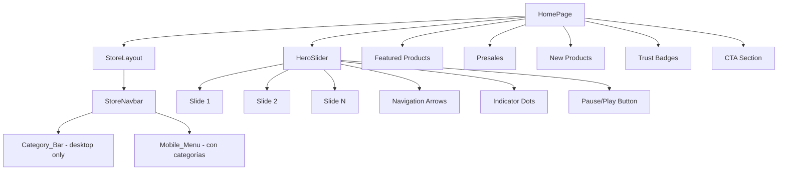
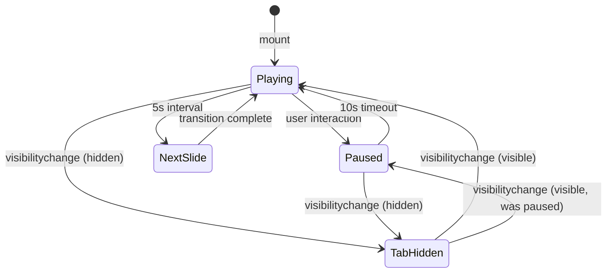

# Design Document: Store Homepage Redesign

## Overview

Rediseño del hero de la HomePage de HobbyZamora para reemplazar el banner actual basado en texto/texturas por un slider de imágenes a ancho completo, inspirado en geekers.cl. Incluye consolidación de la navegación desktop (eliminar links redundantes con la Category_Bar) e integración de categorías en el menú móvil.

Alcance:
- Nuevo componente `HeroSlider` en `src/app/components/design-system/HeroSlider.tsx`
- Modificación de `StoreNavbar.tsx` (eliminar links desktop redundantes, agregar categorías al menú móvil)
- Modificación de `HomePage.tsx` (reemplazar sección hero actual por `HeroSlider`)
- Sin cambios de backend — solo frontend

### Decisiones Técnicas Clave

| Decisión | Elección | Razón |
|----------|----------|-------|
| Librería de animación para slides | `motion` (ya instalada, v12.23) | Evita nueva dependencia. `AnimatePresence` + `motion.div` manejan transiciones horizontales con `animate`/`exit` |
| Swipe en móvil | Pointer events nativos (`onPointerDown`/`onPointerMove`/`onPointerUp`) | Sin dependencia extra. Funciona en touch y mouse. Umbral de 50px para activar cambio de slide |
| Gestión de estado del slider | `useReducer` local | Estado complejo (currentIndex, autoplay, direction, isPaused). Reducer mantiene transiciones predecibles |
| Lazy loading de imágenes | Atributo nativo `loading="lazy"` + `` | Solo el slide actual y adyacentes se cargan eager. El resto lazy. Sin librería extra |
| Aspect ratio responsive | CSS `aspect-ratio` con Tailwind | `aspect-video` (16:9) en desktop, `aspect-[4/3]` en mobile via breakpoint `lg:` |

## Architecture

### Diagrama de Componentes



### Flujo de Datos del HeroSlider



## Components and Interfaces

### 1. HeroSlider Component

Ubicación: `src/app/components/design-system/HeroSlider.tsx`

```typescript
// Tipo de datos para cada slide
export interface HeroSlide {
  id: string;
  image: string;           // URL de la imagen de fondo
  title?: string;          // Título opcional (font-display)
  subtitle?: string;       // Subtítulo opcional (font-body)
  ctaText?: string;        // Texto del botón CTA
  ctaHref?: string;        // URL destino del CTA
}

// Props del componente
export interface HeroSliderProps {
  slides: HeroSlide[];
  autoplayInterval?: number;   // ms, default 5000
  pauseDuration?: number;      // ms, default 10000
  transitionDuration?: number; // ms, default 500
  className?: string;
}
```

Responsabilidades:
- Renderizar slides con transición horizontal animada (motion)
- Autoplay con pausa en interacción y visibilidad de tab
- Navegación: flechas (desktop), swipe (touch), dots, teclado
- Fallback gradient cuando no hay imagen
- Lazy loading de imágenes no visibles
- Accesibilidad: aria-labels, aria-live, keyboard nav, pause button

### 2. Hooks Internos del HeroSlider

```typescript
// useAutoplay — gestiona el timer de autoplay
function useAutoplay(config: {
  enabled: boolean;
  interval: number;
  pauseDuration: number;
  onTick: () => void;
}): {
  pause: () => void;
  resume: () => void;
  isPaused: boolean;
}

// useSwipe — detecta gestos de swipe via pointer events
function useSwipe(config: {
  onSwipeLeft: () => void;
  onSwipeRight: () => void;
  threshold?: number; // default 50px
}): {
  onPointerDown: (e: React.PointerEvent) => void;
  onPointerMove: (e: React.PointerEvent) => void;
  onPointerUp: () => void;
}
```

Estos hooks se definen en el mismo archivo del componente para mantener cohesión. Si crecen, se pueden extraer a un archivo `useHeroSlider.ts`.

### 3. Modificaciones a StoreNavbar

Cambios en `src/app/components/layout/StoreNavbar.tsx`:

**Desktop:** Eliminar el bloque `<div className="hidden md:flex items-center gap-8">` que contiene los links "Tienda", "Productos", "Preventas". La Category_Bar ya cubre esta navegación.

**Mobile Menu:** Agregar sección de categorías con label "Categorías" y separador visual. Las categorías se extraen del mismo array que usa la Category_Bar para evitar duplicación.

```typescript
// Array compartido de categorías (extraer a constante)
const STORE_CATEGORIES = [
  { name: 'Pokémon TCG', href: '/store/products?category=pokemon-tcg' },
  { name: 'Beyblade X', href: '/store/products?category=beyblade-x' },
  { name: 'Pokémon Merch', href: '/store/products?category=pokemon-merch' },
  { name: 'Autos Tomy Tomica', href: '/store/products?category=tomica' },
  { name: 'Figuarts', href: '/store/products?category=figuarts' },
  { name: 'Nintendo', href: '/store/products?category=nintendo' },
  { name: 'Coleccionables Varios', href: '/store/products?category=coleccionables' },
] as const;
```

### 4. Modificaciones a HomePage

Cambios en `src/app/pages/store/HomePage.tsx`:

- Eliminar toda la sección hero actual (noise texture, grid pattern, glow orbs, texto centrado, botones)
- Importar y renderizar `<HeroSlider slides={heroSlides} />` en su lugar
- Definir array `heroSlides` con datos de ejemplo (imágenes placeholder inicialmente)
- Mantener todas las demás secciones sin cambios

## Data Models

### HeroSlide

| Campo | Tipo | Requerido | Descripción |
|-------|------|-----------|-------------|
| `id` | `string` | Sí | Identificador único del slide |
| `image` | `string` | Sí | URL de la imagen de fondo |
| `title` | `string` | No | Título en font-display (Press Start 2P) |
| `subtitle` | `string` | No | Subtítulo en font-body (Outfit) |
| `ctaText` | `string` | No | Texto del botón CTA |
| `ctaHref` | `string` | No | URL destino del CTA |

Restricciones:
- Mínimo 1 slide, máximo 6 slides
- Si `ctaText` está presente, `ctaHref` también debe estarlo
- `image` debe ser una URL válida (relativa o absoluta)

### SliderState (estado interno del reducer)

| Campo | Tipo | Descripción |
|-------|------|-------------|
| `currentIndex` | `number` | Índice del slide activo (0-based) |
| `direction` | `1 \| -1` | Dirección de la transición (1=next, -1=prev) |
| `isAutoplayPaused` | `boolean` | Si el autoplay está pausado por interacción |
| `isTabVisible` | `boolean` | Si el tab del browser está visible |


## Correctness Properties

*A property is a characteristic or behavior that should hold true across all valid executions of a system — essentially, a formal statement about what the system should do. Properties serve as the bridge between human-readable specifications and machine-verifiable correctness guarantees.*

### Property 1: Slide count bounds

*For any* array of `HeroSlide` objects passed to `HeroSlider`, the component shall render between 1 and 6 slides inclusive. If the array length is outside this range, the component shall clamp to the valid range (render first 6 if more, render 1 fallback if empty).

**Validates: Requirements 2.1**

### Property 2: Indicator dots match slide count

*For any* valid slide array of length N (1 ≤ N ≤ 6), the HeroSlider shall render exactly N indicator dots, and exactly one dot shall have the active visual state at any given time.

**Validates: Requirements 2.4**

### Property 3: Dot click navigates to correct slide

*For any* valid slide index `i` (0 ≤ i < N), clicking the i-th indicator dot shall set `currentIndex` to `i`, causing the i-th slide to become visible.

**Validates: Requirements 2.5**

### Property 4: Autoplay advances slide index cyclically

*For any* current slide index `i` in a slider with N slides, when autoplay fires, the new index shall be `(i + 1) % N`.

**Validates: Requirements 3.1**

### Property 5: Slide wrapping (circular navigation)

*For any* slider with N slides, navigating forward from index N-1 shall produce index 0, and navigating backward from index 0 shall produce index N-1.

**Validates: Requirements 2.6, 2.7**

### Property 6: Optional slide content renders if and only if data is present

*For any* `HeroSlide` object, the title element renders if and only if `title` is a non-empty string, the subtitle element renders if and only if `subtitle` is a non-empty string, and the CTA button renders if and only if both `ctaText` and `ctaHref` are non-empty strings.

**Validates: Requirements 4.2, 4.3, 4.4**

### Property 7: Text overlay presence follows text content

*For any* `HeroSlide`, the semi-transparent dark overlay gradient is present if and only if the slide has at least one non-empty text field (`title` or `subtitle`).

**Validates: Requirements 4.5**

### Property 8: Mobile menu contains all categories

*For any* category defined in `STORE_CATEGORIES`, that category's name and href shall appear as a link in the Mobile_Menu when it is open.

**Validates: Requirements 6.1**

### Property 9: Category link tap closes mobile menu

*For any* category link in the Mobile_Menu, clicking it shall set the menu open state to `false`.

**Validates: Requirements 6.4**

### Property 10: Non-active slides use lazy loading

*For any* slide at index `j` where `j ≠ currentIndex`, the image element shall have `loading="lazy"`. The active slide (and optionally adjacent slides) shall have `loading="eager"`.

**Validates: Requirements 8.1**

### Property 11: Indicator dot accessible labels

*For any* indicator dot at position `i` (0-indexed), its `aria-label` shall be `"Ir a slide {i+1}"`.

**Validates: Requirements 8.3**

## Error Handling

| Escenario | Comportamiento |
|-----------|---------------|
| Array de slides vacío | Renderizar un slide con fallback gradient (colores primary → accent del design system) |
| Array de slides > 6 | Truncar a los primeros 6 slides |
| Imagen de slide falla al cargar (`onError`) | Ocultar ``, mostrar fallback gradient en ese slide |
| `ctaText` presente sin `ctaHref` | No renderizar el botón CTA |
| `ctaHref` presente sin `ctaText` | No renderizar el botón CTA |
| Swipe con desplazamiento < umbral (50px) | No cambiar de slide, mantener posición actual |
| Browser no soporta `document.visibilityState` | Autoplay funciona normalmente sin pausa por visibilidad |
| Un solo slide | Ocultar flechas de navegación, indicator dots, y botón pause. No activar autoplay |

## Testing Strategy

### Enfoque Dual: Unit Tests + Property-Based Tests

Ambos tipos de tests son complementarios y necesarios para cobertura completa.

### Property-Based Testing

**Librería:** `fast-check` (compatible con Vitest/Jest, TypeScript nativo)

**Configuración:**
- Mínimo 100 iteraciones por property test
- Cada test debe referenciar su property del design document
- Tag format: `Feature: store-homepage-redesign, Property {N}: {title}`

**Generators necesarios:**
- `arbitraryHeroSlide()`: genera `HeroSlide` con campos opcionales aleatorios
- `arbitrarySlideArray(min, max)`: genera arrays de 1-6 slides
- `arbitrarySlideIndex(n)`: genera índice válido 0..n-1

**Properties a implementar (cada una como un SOLO test):**
1. Property 1: Slide count bounds — generar arrays de 0-10 slides, verificar render clamp
2. Property 2: Indicator dots match — generar arrays 1-6, contar dots renderizados
3. Property 3: Dot click navigation — generar índice, simular click, verificar currentIndex
4. Property 4: Autoplay advance — generar índice y total, verificar (i+1)%N
5. Property 5: Circular navigation — generar N slides, verificar wrap en extremos
6. Property 6: Optional content rendering — generar slides con/sin campos, verificar DOM
7. Property 7: Overlay follows text — generar slides, verificar overlay ↔ text
8. Property 8: Mobile menu categories — generar subset de categorías, verificar presencia
9. Property 9: Category tap closes menu — generar categoría, simular click, verificar estado
10. Property 10: Lazy loading — generar currentIndex y total, verificar loading attrs
11. Property 11: Dot aria-labels — generar N slides, verificar aria-label format

### Unit Tests

Enfocados en ejemplos específicos, edge cases y comportamiento de integración:

- Render del HeroSlider con 1 slide (sin arrows, sin dots, sin autoplay)
- Render con slides de ejemplo con todos los campos
- Fallback gradient cuando imagen falla (simular onError)
- Autoplay pausa en interacción y reanuda después de 10s (fake timers)
- Autoplay pausa/reanuda con visibilitychange
- Keyboard navigation (ArrowLeft, ArrowRight)
- Swipe gesture con umbral
- StoreNavbar: links "Tienda", "Productos", "Preventas" ausentes en desktop
- StoreNavbar: logo, search, cart, account presentes
- Mobile menu: label "Categorías" presente
- Mobile menu: navegación cierra el menú
- Pause/play button con aria-labels correctos
- Navigation arrows con aria-labels "Slide anterior" / "Slide siguiente"
